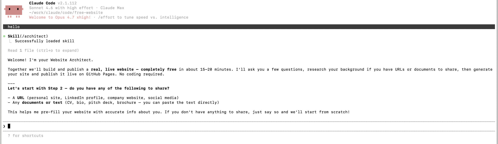
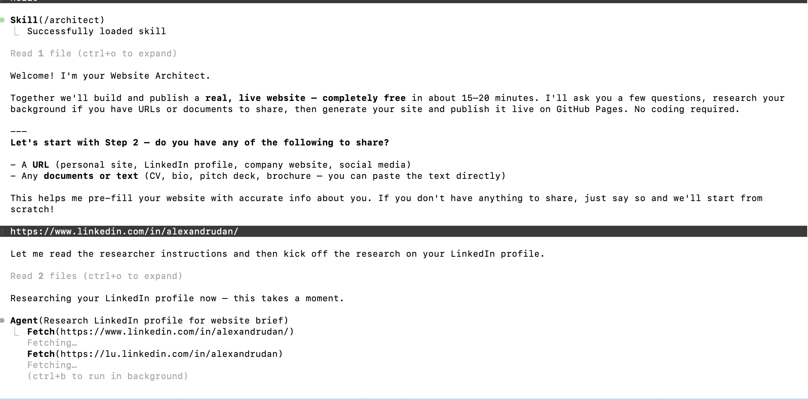
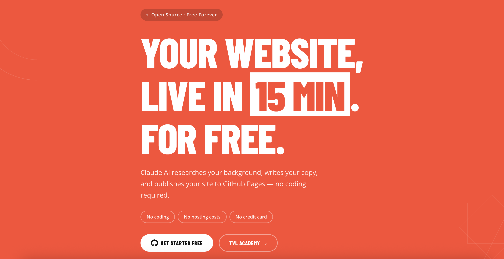
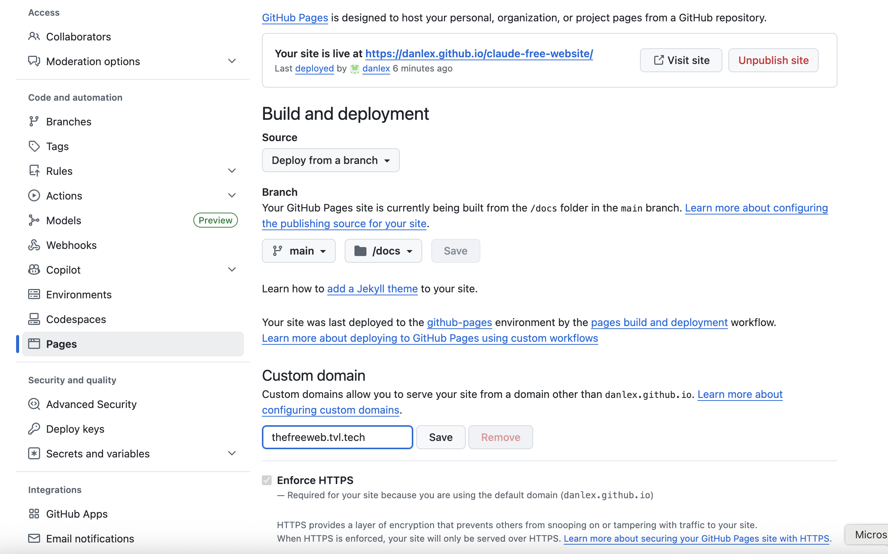
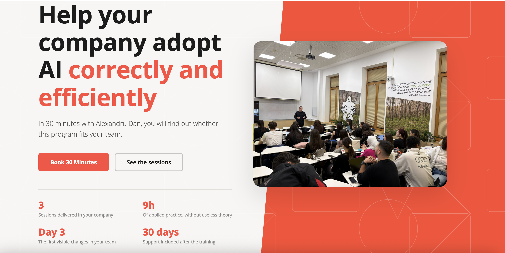

# Free Website — Build & Deploy with Claude + GitHub Pages

Build a real, live website for free in ~15 minutes. No coding required.

**Result:** Your website live at `https://github.com/danlex/claude-free-website`

---

## What you need

- A computer (Mac, Windows, or Linux)
- A free [GitHub account](https://github.com/signup) — takes 2 minutes
- [Node.js 18+](https://nodejs.org) — needed to run Claude Code

---

## Step 1 — Create a free GitHub account

> Already have one? Skip to Step 2.

1. Go to [github.com/signup](https://github.com/signup)
2. Enter your email address and click **Continue**
3. Create a password (at least 8 characters)
4. Choose a username — this will appear in your site URL
5. Verify your email address (check your inbox)


---

## Step 2 — Install Claude Code

Open your terminal (Mac: press `Cmd+Space`, type `Terminal`, press Enter):

```bash
npm install -g @anthropic-ai/claude-code
```

Then log in with your Anthropic account:

```bash
claude login
```

A browser window will open — sign in or create a free account at [claude.ai](https://claude.ai).


---

## Step 3 — Install GitHub CLI

The GitHub CLI lets Claude publish your site automatically.

**Mac:**
```bash
brew install gh
```

**Windows:**
```bash
winget install --id GitHub.cli
```

**Linux:** [See installation guide](https://github.com/cli/cli/blob/trunk/docs/install_linux.md)

Then authenticate:

```bash
gh auth login
```

- Choose **GitHub.com**
- Choose **HTTPS**
- Choose **Login with a web browser**
- Press Enter — a browser opens, click **Authorize**


---

## Step 4 — Fork & clone this repo

**Fork first** (so you own a copy on GitHub):

1. Go to [github.com/danlex/claude-free-website](https://github.com/danlex/claude-free-website)
2. Click the **Fork** button (top right)
3. Click **Create fork**

Then clone your fork:

```bash
git clone https://github.com/YOUR_GITHUB_USERNAME/claude-free-website.git
cd claude-free-website
```

Replace `YOUR_GITHUB_USERNAME` with your actual GitHub username.


---

## Step 5 — Start Claude

```bash
claude
```

Claude greets you immediately as your **Website Architect**:



```
👋 Welcome! I'm your Website Architect.

I'll guide you through building a real, live website — completely free.
No coding required. The whole process takes about 15 minutes.

Here's what I can build for you:
  • Landing page  • Portfolio  • Personal / bio  • Blog  • Company site

And here's what I can't do (so we don't waste your time):
  ✗ User logins or accounts
  ✗ E-commerce or payments
  ✗ Anything needing a database

Ready? Let's start with your background.
Do you have a website, LinkedIn profile, or any documents I can research?
(Or just tell me about yourself in a few sentences.)
```

---

## Step 6 — Share your background (optional)

Paste a URL or describe yourself. Claude researches everything and writes real content — no Lorem Ipsum, no placeholders.

```
You: Here's my site: https://example.com and my LinkedIn: linkedin.com/in/yourname

Claude: Researching your background now...

✓ Found: Senior product designer at Acme Corp (2019–present)
✓ Found: Previously at Google and Shopify
✓ Found: Portfolio projects — Acme rebrand, Shopify Checkout redesign
✓ Found: Based in Toronto, Canada
✓ Contact: hello@yourname.com

Knowledge base saved to website/research.md

A few things I couldn't find — I'll ask you about them shortly.
```

> **Tip:** The more you share, the better your site content will be.



---

## Step 7 — Answer the questions

Claude asks a short set of questions, then builds without further input:

```
Claude: Quick questions before I build:

1. What type of site?
   → landing page / portfolio / personal / blog / company

2. What's the main goal?
   → get clients / show my work / share ideas / promote a product

3. Any color preference?
   → minimal (white+black) / bold (dark+vivid) / warm / professional / creative

You: Portfolio, get clients, minimal

Claude: Got it. Building your site now...

✓ Generated website/index.html  (47 sections, real content throughout)
✓ Generated website/styles.css  (mobile-first, custom properties)
✓ Generated website/script.js   (scroll animations)

Starting preview server at http://localhost:8000
```

---

## Step 8 — Preview your site

Open [http://localhost:8000](http://localhost:8000) in your browser. You'll see your complete site with real content.

Want changes? Just tell Claude:

```
You: Can you make the hero headline shorter and add a contact form at the bottom?

Claude: Done — updated the headline and added a contact form linked to Formspree.
        Refresh http://localhost:8000 to see the changes.

You: Looks great, I'm ready to publish.
```

---

## Step 9 — Publish to GitHub Pages

Tell Claude: **"I'm ready to publish"**

Claude will:
1. Run final validation checks
2. Copy your site files to the `docs/` folder
3. Push to your GitHub fork
4. Enable GitHub Pages on your fork


---

## Step 10 — Your site is live!

```
https://YOUR_USERNAME.github.io/claude-free-website
```

GitHub Pages takes **1–2 minutes** to build. Then your site is live, forever, for free.



---

## Optional: Connect a custom domain

If you own a domain (e.g., `www.yourbusiness.com`):

### Step A — Tell Claude your domain

```
I want to use my custom domain www.yourdomain.com
```

Claude will add a `CNAME` file and re-publish automatically.

### Step B — Add a DNS record at your registrar

Log in to wherever you bought your domain (Namecheap, Google Domains, GoDaddy, etc.) and add:

| Type | Name | Value |
|------|------|-------|
| CNAME | www | `yourusername.github.io` |

> **Using a root/apex domain** (e.g., `yourdomain.com` without `www`)? Add 4 A records instead:
>
> `185.199.108.153` · `185.199.109.153` · `185.199.110.153` · `185.199.111.153`

### Step C — Enable HTTPS in GitHub

1. Go to `https://github.com/YOUR_USERNAME/YOUR_REPO/settings/pages`
2. Under **Custom domain**, enter your domain and click **Save**
3. Wait ~10 minutes for DNS to propagate
4. Check **Enforce HTTPS** when it appears




---

## Making changes later

```bash
cd claude-free-website
claude
```

Tell Claude what you want to change — it updates the files and re-publishes automatically.

---

## Available commands (inside Claude)

| Command | What it does |
|---------|-------------|
| `/architect` | Start or restart the guided flow |
| `/research` | Research a person or company from URLs or documents |
| `/build` | Generate (or regenerate) your website |
| `/preview` | View your site locally at http://localhost:8000 |
| `/publish` | Push to GitHub and go live |
| `/check` | Validate before publishing |

---

## What it can build

| Type | Description |
|------|-------------|
| Landing page | Hero, features, CTA — great for products or services |
| Portfolio | Projects grid, case studies — great for designers & developers |
| Personal / bio | About, links, contact — great for personal brand |
| Blog | Post list, clean reading layout |
| Company website | Services, team, testimonials, contact form |

## What it cannot build

- Apps with user accounts or logins
- E-commerce / checkout / payments
- Anything requiring a database or server-side code

---

## Cost breakdown

| Item | Cost |
|------|------|
| Hosting (GitHub Pages) | **Free** |
| This template | **Free** |
| Claude Code | **Free tier available** |
| Custom domain (optional) | ~$10–15/year |
| Contact forms (Formspree free) | **Free** (50/month) |

---

## License

MIT — fork it, customize it, use it for any project.

---

## Want to learn AI properly?

**[TVL Academy](https://academy.tvl.tech)** — professional AI training by TVL Technology.

A 9-hour program (3 × 3h sessions) designed for teams of 10–20 people:
- **Session 1:** Prompt Engineering — build a personalized prompt library using 18 techniques
- **Session 2:** Custom AI Assistant per Role — configure AI tools for each job function
- **Session 3:** AI Design Sprint — identify and prioritize automation opportunities

Includes 30 days of post-training support and EU AI Act compliance documentation.
Delivered onsite anywhere in Romania or remotely.

[Book a free 30-minute consultation →](https://academy.tvl.tech/en/)



---

Built with ❤️ by [TVL Technology](https://tvl.tech)
